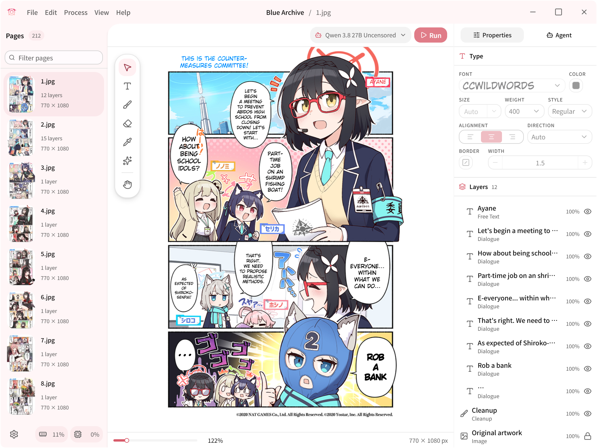

<h1 align="center">Koharu</h1>

<p align="center">ML-powered manga translator, written in <b>Rust</b>.</p>

<p align="center">
<a href="https://github.com/Endymi0n74/Koharu/releases/latest" target="_blank"></a>
<a href="https://github.com/Endymi0n74/Koharu/releases" target="_blank"></a>
<a href="https://github.com/Endymi0n74/Koharu/actions/workflows/koharu-batch.yml" target="_blank"></a>
</p>

<p align="center">
<a href="https://github.com/Endymi0n74/Koharu/releases" target="_blank">Releases</a> · <a href="https://koharu.rs/" target="_blank">Docs</a> · <a href="packages/docs/en/fork.mdx" target="_blank">Batch CLI guide</a> · <a href="https://github.com/Endymi0n74/Koharu/issues" target="_blank">Bug reports</a> · <a href="https://discord.gg/mHvHkxGnUY" target="_blank">Discord</a>
</p>

<p align="center">
<a href="https://koharu.rs/ja" target="_blank">日本語</a> | <a href="https://koharu.rs/zh" target="_blank">简体中文</a>
</p>

[🇫🇷 Français](README.md) · **🇬🇧 English**

Koharu introduces a local-first workflow for manga translation, utilizing the power of ML to automate the process. It combines the capabilities of object detection, OCR, inpainting, and LLMs to create a seamless translation experience.

> [!NOTE]
> Koharu runs its vision models and LLMs **locally** on your machine to keep your data private and secure.

---



## Features

- [Multi-format project management](https://koharu.rs/en/guides/projects) for raster images, archives, and PDFs with page sequencing
- [Selective pipeline](https://koharu.rs/en/guides/processing) for detection, OCR, translation, and inpainting at page or project scope
- [Detection and segmentation](https://koharu.rs/en/guides/processing) for text regions, speech bubbles, and cleanup regions
- [Multimodal OCR](https://koharu.rs/en/models/vision) for dialogue, captions, and general page text
- [Local GGUF inference and hosted providers](https://koharu.rs/en/models/providers) for LLM and machine-translation workflows
- [Generative inpainting](https://koharu.rs/en/guides/cleanup) for source-text removal and artwork reconstruction
- [Proofreading](https://koharu.rs/en/guides/review) for correcting OCR and translation output
- [WebGPU-based canvas](https://koharu.rs/en/guides/canvas) for manual cleanup, text placement, and page composition
- [Multilingual text shaping and layout](https://koharu.rs/en/guides/typesetting) with automatic fitting, font fallback, vertical CJK, and right-to-left text
- [Layered PSD export](https://koharu.rs/en/guides/export) for flattened delivery and layered editing
- [Agent-based workflow](https://koharu.rs/en/agent/projects) for project inspection, editing, and pipeline control

## What this fork adds

This repository is a fork of [koharu-rs/koharu](https://github.com/koharu-rs/koharu): the base app stays intact and gains the tooling around it.

- **The `koharu-batch` CLI** — translates whole chapters from the terminal: a folder of scans or a CBZ archive in, translated pages out (`--lang` for the target), or a **whole volume** where every subfolder or `.cbz` becomes its own chapter. **Phase-major** execution (each model loads once instead of once per page), page-by-page resume including resume from an existing output CBZ, `--no-vision` for text-only runs, an end-of-run HTML/Markdown report with before/after previews, a machine-readable `--json` summary, and exit code 0 only when every page succeeded (ready for CI).
- **Calibrated automatic model picking** — the strongest model that fits the actually-free VRAM budget, with measured calibration (`~/.koharu/vram-calibration.toml` records real peaks), a **2 B quality floor** (actionable refusal below the floor, `--force` to bypass it), a **Qwen 2 B fallback** when calibrated gemmas overflow the budget, and a warning before a large first download. `koharu-batch models` lists the catalog with VRAM estimates.
- **Reproducibility** — `--deterministic` and `--torch-fp32` for identical sessions across runs, `--ocr-cache` to freeze OCR reads, `--verify` to check the outputs, `--retries` to re-attempt segments a response left untranslated.
- **Folder mode in the app** — the GUI launches `koharu-batch` with a model and hosted-provider picker, shows the running model in the activity center, and reports errors inline.
- **Hosted providers in batch runs** — `--provider openai_compatible`, `lm_studio`, and other OpenAI-compatible endpoints.
- **Store maintenance** — `koharu-batch prune` finds orphaned models, datasets, and runtimes (add `--delete` to remove them); `KOHARU_STORE` moves the store off the system drive.
- **An extended catalog** — uncensored Gemma 4 and Qwen variants (HauhauCS) alongside the upstream models.

```bash
# Preview what would run (pages, model, VRAM) without executing anything
koharu-batch --input ./chapter-12 --output ./chapter-12-fr --dry-run

# A folder of scans → a folder of translated pages
koharu-batch --input ./chapter-12 --output ./chapter-12-fr

# A CBZ archive → a CBZ archive, letting the tool pick the model for your GPU
koharu-batch --input ./chapter-13.cbz --output ./chapter-13-fr.cbz

# A whole volume: every subfolder and .cbz of ./series becomes one chapter
koharu-batch --input ./series --output ./series-fr

# Machine-readable summary of the run (works with --dry-run too)
koharu-batch --input ./chapter-12 --output ./chapter-12-fr --json run.json

# Text-only run: skip detection, OCR and inpainting
koharu-batch --input ./chapter-14 --output ./chapter-14-fr --no-vision

# Reproducible run: greedy translation + fp32 Torch stages (detection, inpainting)
koharu-batch --input ./chapter-12 --output ./chapter-12-fr --deterministic --torch-fp32

# List local models with their VRAM estimates (measured peaks included)
koharu-batch models
```

See [packages/docs/en/fork.mdx](packages/docs/en/fork.mdx) for the full batch documentation.

## Hardware Acceleration

Koharu supports CUDA and ROCm / HIP on Windows and Linux, Metal on Apple silicon, and Vulkan on Windows and Linux. Keep your graphics driver current; a full CUDA or ROCm SDK installation is not required. See [Runtime and hardware requirements](https://koharu.rs/en/hardware) for model-specific guidance.

### CUDA

CUDA 13.3 requires an NVIDIA Turing-class or newer GPU and an R610 or newer driver. Check NVIDIA's official [CUDA toolkit, driver, and architecture matrix](https://docs.nvidia.com/datacenter/tesla/drivers/cuda-toolkit-driver-and-architecture-matrix.html) and install the [latest NVIDIA driver](https://www.nvidia.com/en-us/drivers/).

### ROCm / HIP

ROCm 10.0 support depends on the exact AMD GPU, operating system, and driver combination. Check AMD's official [ROCm 10.0.0 compatibility matrix](https://rocm.docs.amd.com/en/docs-10.0.0/compatibility/compatibility-matrix.html) and install a compatible [AMD driver](https://www.amd.com/en/support).

### Metal

Metal is available on Apple silicon Macs.

### Vulkan

Vulkan is available on Windows and Linux as an alternative to CUDA and ROCm / HIP.

### WebGPU

The editor canvas uses WebGPU and requires a current graphics driver even when inference runs on the CPU.

### CPU

CPU inference is available for supported workloads but is substantially slower.

## Machine Learning Models

Koharu uses separate models for detection, OCR, inpainting, and translation. [Vision and inpainting](https://koharu.rs/en/models/vision) and [translation and generation](https://koharu.rs/en/models/translation) have separate model settings.

### Computer Vision Models

Detection, OCR, and inpainting models are selected separately.

#### Detection and Layout

The detection model finds text regions, speech bubbles, and segmentation masks.

- [Koharu Layout RF-DETR Seg 2XL](https://huggingface.co/mayocream/koharu-layout-rfdetr-seg-2xl-1152)

#### OCR

OCR reads source text from detected regions.

- [PaddleOCR VL 1.6](https://huggingface.co/PaddlePaddle/PaddleOCR-VL-1.6)
- [Manga OCR](https://huggingface.co/mayocream/manga-ocr)
- [Baberu OCR](https://huggingface.co/genshiai-daichi/baberu-ocr)
- [Hayai OCR](https://huggingface.co/JustANormalTinkerer/hayai-ocr-v2)

#### Inpainting

Inpainting reconstructs the image behind source text before the translation is rendered.

- [FLUX.2 Klein](https://huggingface.co/unsloth/FLUX.2-klein-4B-GGUF)
- [Qwen Image 2.1](https://huggingface.co/leejet/Qwen-Image-2.1-GGUF)
- [RORem mixed](https://huggingface.co/mayocream/RORem-mixed-GGUF)
- [LaMa](https://huggingface.co/mayocream/lama-manga)
- [AOT GAN](https://huggingface.co/mayocream/aot-inpainting)

### Large Language Models

Translation can use a local language model or a remote API.

#### General-Purpose Local Models

- Gemma 4 (QAT): [gemma4-e2b-it](https://huggingface.co/unsloth/gemma-4-E2B-it-qat-GGUF), [gemma4-e4b-it](https://huggingface.co/unsloth/gemma-4-E4B-it-qat-GGUF), [gemma4-12b-it](https://huggingface.co/unsloth/gemma-4-12B-it-qat-GGUF), [gemma4-26b-a4b-it](https://huggingface.co/unsloth/gemma-4-26B-A4B-it-qat-GGUF), [gemma4-31b-it](https://huggingface.co/unsloth/gemma-4-31B-it-qat-GGUF)
- Qwen 3.5: [qwen3.5-0.8b](https://huggingface.co/unsloth/Qwen3.5-0.8B-GGUF), [qwen3.5-2b](https://huggingface.co/unsloth/Qwen3.5-2B-GGUF), [qwen3.5-4b](https://huggingface.co/unsloth/Qwen3.5-4B-GGUF), [qwen3.5-9b](https://huggingface.co/unsloth/Qwen3.5-9B-GGUF), [qwen3.5-27b](https://huggingface.co/unsloth/Qwen3.5-27B-GGUF), [qwen3.5-35b-a3b](https://huggingface.co/unsloth/Qwen3.5-35B-A3B-GGUF)
- Qwen 3.6: [qwen3.6-27b](https://huggingface.co/unsloth/Qwen3.6-27B-GGUF), [qwen3.6-35b-a3b](https://huggingface.co/unsloth/Qwen3.6-35B-A3B-GGUF)
- Qwen 3.8: [qwen3.8-27b](https://huggingface.co/unsloth/Qwen3.8-27B-GGUF)

#### Uncensored Local Models

- Gemma 4 uncensored: [gemma4-e2b-uncensored](https://huggingface.co/HauhauCS/Gemma-4-E2B-Uncensored-HauhauCS-Aggressive), [gemma4-e4b-uncensored](https://huggingface.co/HauhauCS/Gemma-4-E4B-Uncensored-HauhauCS-Aggressive), [gemma4-12b-uncensored](https://huggingface.co/HauhauCS/Gemma4-12B-QAT-Uncensored-HauhauCS-Balanced), [gemma4-26b-a4b-uncensored](https://huggingface.co/HauhauCS/Gemma4-26B-A4B-QAT-Uncensored-HauhauCS-Balanced-MTP), [gemma4-31b-uncensored](https://huggingface.co/HauhauCS/Gemma4-31B-QAT-Uncensored-HauhauCS-Balanced-MTP)
- Qwen 3.5 uncensored: [qwen3.5-2b-uncensored](https://huggingface.co/HauhauCS/Qwen3.5-2B-Uncensored-HauhauCS-Aggressive), [qwen3.5-4b-uncensored](https://huggingface.co/HauhauCS/Qwen3.5-4B-Uncensored-HauhauCS-Aggressive), [qwen3.5-9b-uncensored](https://huggingface.co/HauhauCS/Qwen3.5-9B-Uncensored-HauhauCS-Aggressive)
- Qwen 3.6 uncensored: [qwen3.6-27b-uncensored](https://huggingface.co/HauhauCS/Qwen3.6-27B-Uncensored-HauhauCS-Balanced), [qwen3.6-35b-a3b-uncensored](https://huggingface.co/HauhauCS/Qwen3.6-35B-A3B-Uncensored-HauhauCS-Aggressive)
- Qwen 3.8 uncensored: [qwen3.8-27b-uncensored](https://huggingface.co/HauhauCS/Qwen3.8-27B-Uncensored-HauhauCS-Aggressive-MTP-GGUF)

#### Cloud Providers

Hosted LLM providers: [OpenAI](https://platform.openai.com/), [Gemini](https://ai.google.dev/), [Claude](https://www.anthropic.com/api), [Grok](https://docs.x.ai/developers), [MiniMax](https://platform.minimax.io/), [DeepSeek](https://platform.deepseek.com/), and [OpenRouter](https://openrouter.ai/).

#### Machine Translation Providers

Machine-translation providers: [DeepL](https://www.deepl.com/), [Google Cloud Translation](https://cloud.google.com/translate), and [Caiyun](https://fanyi.caiyunapp.com/).

#### OpenAI-Compatible Providers

OpenAI-compatible endpoints are also supported.

## Installation

Download builds from this repository's [releases page](https://github.com/Endymi0n74/Koharu/releases/latest):

- **Windows** — `koharu_*_x64-setup.exe` (installer) or `koharu_*_x64_en-US.msi`, plus the standalone `koharu-batch.exe`;
- **Linux** — AppImage, `.deb`, and `.rpm` packages (amd64 and arm64).

Every binary ships with its `.sig` signature, and `latest.json` references the version for the built-in updater. [Installation requirements and first launch](https://koharu.rs/en/installation) vary by operating system.

> [!NOTE]
> This branch publishes builds for **Windows and Linux**. On macOS, build from the sources (see **Development** below): the macOS CI leg is disabled, but Metal remains supported.

## Troubleshooting

Startup, runtime, model, and provider errors are covered in [Troubleshooting](https://koharu.rs/en/reference/troubleshooting). Set `RUST_LOG` to `debug` or `trace` for verbose logs:

```bash
# macOS / Linux
RUST_LOG=debug koharu
# Windows (PowerShell)
$env:RUST_LOG="debug"; koharu.exe
```

## Development

Platform dependencies and validation commands for local builds are listed in [Development Setup](https://koharu.rs/en/development/setup).

### Prerequisites

- [Rust](https://www.rust-lang.org/tools/install) 1.97.1 or later (Rust 2024 edition)
- [Bun](https://bun.sh/) 1.3.14 or later
- [LLVM](https://llvm.org/) 22.1.8 or later

### Install dependencies

```bash
bun install
```

### Run in development

```bash
bun dev
```

### Build

```bash
bun run build
```

The executable is written to `target/release`.

### Validation

Repository validation commands:

```bash
cargo fmt --all -- --check
cargo clippy --workspace -- -D warnings
cargo test --workspace --tests
bun run lint
bun run test
bun run --filter '@koharu/*' typecheck
bun scripts/check-path-portability.ts
```

## Sponsorship

If Koharu is useful in your workflow, consider sponsoring the project.

- [GitHub Sponsors](https://github.com/sponsors/mayocream)
- [Patreon](https://www.patreon.com/mayocream)


## Contributors ❤️

Thanks to all the contributors who have helped make Koharu better!

<a href="https://github.com/Endymi0n74/Koharu/graphs/contributors">
  
</a>

## License

Copyright 2025-2026 Mayo Takanashi and Koharu contributors.

Koharu is dual-licensed under the [MIT License](LICENSE-MIT) or the
[Apache License, Version 2.0](LICENSE-APACHE), at your option.
