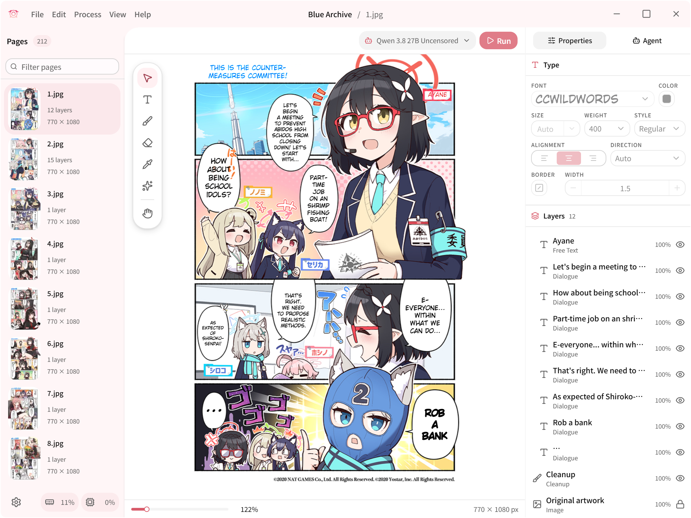

<h1 align="center">Koharu</h1>

> [!NOTE]
> **Fork Endymi0n74** — nettoyage UI : `41` composants `packages/ui/src/components/*.tsx` jamais importés purgés + 1 hook `use-mobile.ts` + 6 deps lourdes retirées (`cmdk` `date-fns` `embla-carousel-react` `input-otp` `react-day-picker` `recharts`), `typecheck @koharu/ui` vert. Voir `packages/ui/package.json`.

<p align="center">Traducteur de manga propulsé par le ML, écrit en <b>Rust</b>.</p>

<p align="center">
<a href="https://github.com/koharu-rs/koharu/releases/latest" target="_blank"></a>
</p>

<p align="center">
<a href="https://github.com/Endymi0n74/Koharu/actions/workflows/koharu-batch.yml" target="_blank"></a>
</p>

<p align="center">
<a href="https://trendshift.io/repositories/20649" target="_blank"></a>
</p>

<p align="center">
<a href="https://koharu.rs/en/installation" target="_blank">Getting Started</a> · <a href="https://koharu.rs/" target="_blank">Docs</a> · <a href="https://github.com/koharu-rs/koharu/issues" target="_blank">Bug reports</a> · <a href="https://discord.gg/mHvHkxGnUY" target="_blank">Discord</a>
</p>

<p align="center">
<a href="https://koharu.rs/ja" target="_blank">日本語</a> | <a href="https://koharu.rs/zh" target="_blank">简体中文</a>
</p>

**🇫🇷 Français** · [🇬🇧 English](README.en.md)

Koharu introduit un workflow local-first pour la traduction de manga, en exploitant la puissance du ML pour automatiser le processus. Il combine les capacités de détection d'objets, d'OCR, d'inpainting et des LLM afin de créer une expérience de traduction fluide.

> [!NOTE]
> Koharu exécute ses modèles de vision et ses LLM **localement** sur votre machine pour que vos données restent privées et sécurisées.

---



> [!NOTE]
> Rejoignez notre [serveur Discord](https://discord.gg/mHvHkxGnUY) pour obtenir de l'aide et échanger.

## Fonctionnalités

- [Gestion de projets multi-formats](https://koharu.rs/en/guides/projects) pour images matricielles, archives et PDF, avec séquencement des pages
- [Pipeline sélectif](https://koharu.rs/en/guides/processing) pour la détection, l'OCR, la traduction et l'inpainting au niveau de la page ou du projet
- [Détection et segmentation](https://koharu.rs/en/guides/processing) des zones de texte, des bulles de dialogue et des zones de nettoyage
- [OCR multimodal](https://koharu.rs/en/models/vision) pour les dialogues, les légendes et le texte général de la page
- [Inférence GGUF locale et fournisseurs hébergés](https://koharu.rs/en/models/providers) pour les workflows LLM et de traduction automatique
- [Inpainting génératif](https://koharu.rs/en/guides/cleanup) pour la suppression du texte source et la reconstruction de l'illustration
- [Relecture](https://koharu.rs/en/guides/review) pour corriger les sorties de l'OCR et de la traduction
- [Canvas basé sur WebGPU](https://koharu.rs/en/guides/canvas) pour le nettoyage manuel, le placement du texte et la composition des pages
- [Mise en forme et disposition multilingues du texte](https://koharu.rs/en/guides/typesetting) avec ajustement automatique, repli de polices, CJK vertical et texte de droite à gauche
- [Export PSD en calques](https://koharu.rs/en/guides/export) pour une livraison aplatie et une édition en calques
- [Workflow basé sur des agents](https://koharu.rs/en/agent/projects) pour l'inspection et l'édition des projets, ainsi que le contrôle du pipeline

> [!TIP]
> **CLI par lot — `koharu-batch`.** Cette branche ajoute une CLI headless qui traduit des chapitres
> entiers depuis le terminal avec le même pipeline local : un dossier de scans ou une archive CBZ en
> entrée, des pages françaises en sortie (`--lang` pour changer la cible) — ou un **volume entier** :
> pointez-la vers un dossier de sous-dossiers/archives et chacun devient son propre chapitre, en
> sortie en miroir sous `--output` avec un rapport par chapitre. Les pages s'exécutent en mode
> **phase-major** — une étape à la fois sur toutes les pages (de tout le volume), si bien que les
> modèles sont chargés une seule fois au lieu d'une fois par page — le budget VRAM est plafonné par
> la mémoire réellement disponible, `--no-vision` saute la détection, l'OCR et l'inpainting pour les
> exécutions uniquement textuelles, et le processus ne renvoie le code 0 que si toutes les pages de
> tous les chapitres ont réussi (prêt pour la CI). Il choisit le modèle le plus performant qui tient
> dans le budget de votre GPU (avertissement avant un premier téléchargement important), traduit
> chaque page avec le contexte des pages précédentes, réessaie les segments qu'une réponse a laissés
> non traduits, prend en charge la reprise page par page (y compris les entrées reprises d'une
> archive CBZ de sortie existante) et écrit un rapport HTML/Markdown de fin d'exécution avec des
> aperçus avant/après des pages — plus un résumé `--json` lisible par les machines (`--retries`,
> `--pages`, `--recursive`, `--quiet` complètent le contrôle de l'exécution). Voir
> [packages/docs/en/fork.mdx](packages/docs/en/fork.mdx) pour la documentation complète.

```bash
# Preview what would run (pages, model, VRAM) without executing anything
koharu-batch --input ./chapter-12 --output ./chapter-12-fr --dry-run

# A folder of scans → a folder of translated pages
koharu-batch --input ./chapter-12 --output ./chapter-12-fr

# A CBZ archive → a CBZ archive, letting the tool pick the model for your GPU
koharu-batch --input ./chapter-13.cbz --output ./chapter-13-fr.cbz

# A whole volume: every subfolder and .cbz of ./series becomes one chapter
koharu-batch --input ./series --output ./series-fr

# Machine-readable summary of the run (works with --dry-run too)
koharu-batch --input ./chapter-12 --output ./chapter-12-fr --json run.json

# Text-only run: skip detection, OCR and inpainting
koharu-batch --input ./chapter-14 --output ./chapter-14-fr --no-vision

# List local models with their VRAM estimates (measured peaks included)
koharu-batch --list-models
```

## Accélération matérielle

Koharu prend en charge CUDA et ROCm / HIP sur Windows et Linux, Metal sur les puces Apple, et Vulkan sur Windows et Linux. Gardez votre pilote graphique à jour ; une installation complète du SDK CUDA ou ROCm n'est pas requise. Consultez [Exigences d'exécution et matérielles](https://koharu.rs/en/hardware) pour des recommandations propres à chaque modèle.

### CUDA

CUDA 13.3 nécessite un GPU NVIDIA de classe Turing ou plus récent, ainsi qu'un pilote R610 ou plus récent. Consultez la [matrice CUDA toolkit, pilotes et architectures](https://docs.nvidia.com/datacenter/tesla/drivers/cuda-toolkit-driver-and-architecture-matrix.html) officielle d'NVIDIA et installez le [dernier pilote NVIDIA](https://www.nvidia.com/en-us/drivers/).

### ROCm / HIP

La prise en charge de ROCm 10.0 dépend de la combinaison exacte du GPU AMD, du système d'exploitation et du pilote. Consultez la [matrice de compatibilité ROCm 10.0.0](https://rocm.docs.amd.com/en/docs-10.0.0/compatibility/compatibility-matrix.html) officielle d'AMD et installez un [pilote AMD](https://www.amd.com/en/support) compatible.

### Metal

Metal est disponible sur les Mac à puces Apple.

### Vulkan

Vulkan est disponible sur Windows et Linux en alternative à CUDA et ROCm / HIP.

### WebGPU

Le canvas de l'éditeur utilise WebGPU et nécessite un pilote graphique à jour, même lorsque l'inférence s'exécute sur le CPU.

### CPU

L'inférence sur CPU est disponible pour les charges de travail prises en charge, mais elle est nettement plus lente.

## Modèles d'apprentissage automatique

Koharu utilise des modèles distincts pour la détection, l'OCR, l'inpainting et la traduction. [Vision et inpainting](https://koharu.rs/en/models/vision) et [traduction et génération](https://koharu.rs/en/models/translation) ont des paramètres de modèle séparés.

### Modèles de vision par ordinateur

Les modèles de détection, d'OCR et d'inpainting sont sélectionnés séparément.

#### Détection et disposition

Le modèle de détection trouve les zones de texte, les bulles de dialogue et les masques de segmentation.

- [Koharu Layout RF-DETR Seg 2XL](https://huggingface.co/mayocream/koharu-layout-rfdetr-seg-2xl-1152)

#### OCR

L'OCR lit le texte source à partir des zones détectées.

- [PaddleOCR VL 1.6](https://huggingface.co/PaddlePaddle/PaddleOCR-VL-1.6)
- [Manga OCR](https://huggingface.co/mayocream/manga-ocr)
- [Baberu OCR](https://huggingface.co/genshiai-daichi/baberu-ocr)
- [Hayai OCR](https://huggingface.co/JustANormalTinkerer/hayai-ocr-v2)

#### Inpainting

L'inpainting reconstruit l'image derrière le texte source avant que la traduction ne soit rendue.

- [FLUX.2 Klein](https://huggingface.co/unsloth/FLUX.2-klein-4B-GGUF)
- [RORem mixed](https://huggingface.co/mayocream/RORem-mixed-GGUF)
- [LaMa](https://huggingface.co/mayocream/lama-manga)
- [AOT GAN](https://huggingface.co/mayocream/aot-inpainting)

### Grands modèles de langage

La traduction peut utiliser un modèle de langage local ou une API distante.

#### Modèles locaux généralistes

- LFM 2.5 : [lfm2.5-1.2b-instruct](https://huggingface.co/LiquidAI/LFM2.5-1.2B-Instruct-GGUF)
- Ministral 3 : [ministral-3-8b-instruct](https://huggingface.co/mistralai/Ministral-3-8B-Instruct-2512-GGUF)
- Gemma 4 : [gemma4-e2b-it](https://huggingface.co/unsloth/gemma-4-E2B-it-qat-GGUF), [gemma4-e4b-it](https://huggingface.co/unsloth/gemma-4-E4B-it-qat-GGUF), [gemma4-12b-it](https://huggingface.co/unsloth/gemma-4-12B-it-qat-GGUF), [gemma4-26b-a4b-it](https://huggingface.co/unsloth/gemma-4-26B-A4B-it-qat-GGUF), [gemma4-31b-it](https://huggingface.co/unsloth/gemma-4-31B-it-qat-GGUF)
- Qwen 3.5 : [qwen3.5-0.8b](https://huggingface.co/unsloth/Qwen3.5-0.8B-GGUF), [qwen3.5-2b](https://huggingface.co/unsloth/Qwen3.5-2B-GGUF), [qwen3.5-4b](https://huggingface.co/unsloth/Qwen3.5-4B-GGUF), [qwen3.5-9b](https://huggingface.co/unsloth/Qwen3.5-9B-GGUF), [qwen3.5-27b](https://huggingface.co/unsloth/Qwen3.5-27B-GGUF), [qwen3.5-35b-a3b](https://huggingface.co/unsloth/Qwen3.5-35B-A3B-GGUF)
- Qwen 3.6 : [qwen3.6-27b](https://huggingface.co/unsloth/Qwen3.6-27B-GGUF), [qwen3.6-35b-a3b](https://huggingface.co/unsloth/Qwen3.6-35B-A3B-GGUF)
- Qwen 3.8 : [qwen3.8-27b](https://huggingface.co/unsloth/Qwen3.8-27B-GGUF)

#### Modèles locaux non censurés

- Gemma 4 non censuré : [gemma4-e2b-uncensored](https://huggingface.co/HauhauCS/Gemma-4-E2B-Uncensored-HauhauCS-Aggressive), [gemma4-e4b-uncensored](https://huggingface.co/HauhauCS/Gemma-4-E4B-Uncensored-HauhauCS-Aggressive), [gemma4-12b-uncensored](https://huggingface.co/HauhauCS/Gemma4-12B-QAT-Uncensored-HauhauCS-Balanced), [gemma4-26b-a4b-uncensored](https://huggingface.co/HauhauCS/Gemma4-26B-A4B-QAT-Uncensored-HauhauCS-Balanced-MTP), [gemma4-31b-uncensored](https://huggingface.co/HauhauCS/Gemma4-31B-QAT-Uncensored-HauhauCS-Balanced-MTP)
- Qwen 3.5 non censuré : [qwen3.5-2b-uncensored](https://huggingface.co/HauhauCS/Qwen3.5-2B-Uncensored-HauhauCS-Aggressive), [qwen3.5-4b-uncensored](https://huggingface.co/HauhauCS/Qwen3.5-4B-Uncensored-HauhauCS-Aggressive), [qwen3.5-9b-uncensored](https://huggingface.co/HauhauCS/Qwen3.5-9B-Uncensored-HauhauCS-Aggressive)
- Qwen 3.6 non censuré : [qwen3.6-27b-uncensored](https://huggingface.co/HauhauCS/Qwen3.6-27B-Uncensored-HauhauCS-Balanced), [qwen3.6-35b-a3b-uncensored](https://huggingface.co/HauhauCS/Qwen3.6-35B-A3B-Uncensored-HauhauCS-Aggressive)
- Qwen 3.8 non censuré : [qwen3.8-27b-uncensored](https://huggingface.co/HauhauCS/Qwen3.8-27B-Uncensored-HauhauCS-Aggressive-MTP-GGUF)

#### Fournisseurs cloud

Fournisseurs LLM hébergés : [OpenAI](https://platform.openai.com/), [Gemini](https://ai.google.dev/), [Claude](https://www.anthropic.com/api), [Grok](https://docs.x.ai/developers), [MiniMax](https://platform.minimax.io/), [DeepSeek](https://platform.deepseek.com/) et [OpenRouter](https://openrouter.ai/).

#### Fournisseurs de traduction automatique

Fournisseurs de traduction automatique : [DeepL](https://www.deepl.com/), [Google Cloud Translation](https://cloud.google.com/translate) et [Caiyun](https://fanyi.caiyunapp.com/).

#### Fournisseurs compatibles OpenAI

Les points d'accès compatibles OpenAI sont également pris en charge.

## Installation

Téléchargez les builds de version depuis la [page des releases](https://github.com/koharu-rs/koharu/releases/latest). [Les prérequis d'installation et le premier lancement](https://koharu.rs/en/installation) varient selon le système d'exploitation.

Des builds sont disponibles pour Windows, macOS et Linux.

### WinGet

Installation sur Windows avec [winget](https://learn.microsoft.com/en-us/windows/package-manager/winget/) :

```bash
winget install koharu
```

### Homebrew

Installation sur macOS avec [Homebrew](https://brew.sh/) :

```bash
brew install --cask koharu
```

## Dépannage

Les erreurs de démarrage, d'exécution, de modèle et de fournisseur sont traitées dans [Dépannage](https://koharu.rs/en/reference/troubleshooting). Définissez `RUST_LOG` sur `debug` ou `trace` pour des journaux verbeux :

```bash
# macOS / Linux
RUST_LOG=debug koharu
# Windows (PowerShell)
$env:RUST_LOG="debug"; koharu.exe
```

## Développement

Les dépendances de plateforme et les commandes de validation pour les builds locaux sont listées dans [Configuration du développement](https://koharu.rs/en/development/setup).

### Prérequis

- [Rust](https://www.rust-lang.org/tools/install) 1.97.1 ou version supérieure (édition Rust 2024)
- [Bun](https://bun.sh/) 1.3.14 ou version supérieure
- [LLVM](https://llvm.org/) 22.1.8 ou version supérieure

### Installer les dépendances

```bash
bun install
```

### Développement

```bash
bun dev
```

### Compilation

```bash
bun run build
```

L'exécutable est écrit dans `target/release`.

## Sponsoring

Si Koharu est utile dans votre flux de travail, envisagez de soutenir le projet.

- [GitHub Sponsors](https://github.com/sponsors/mayocream)
- [Patreon](https://www.patreon.com/mayocream)


## Contributeurs ❤️

Merci à toutes les personnes qui ont aidé à rendre Koharu meilleur !

<a href="https://github.com/koharu-rs/koharu/graphs/contributors">
  
</a>

## Licence

Copyright 2025-2026 Mayo Takanashi et les contributeurs de Koharu.

Koharu est sous licence double : la [Licence MIT](LICENSE-MIT) ou la
[Apache License, version 2.0](LICENSE-APACHE), à votre convenance.
